# Profile Control Plane

[](https://github.com/majiayu000/profile-control-plane/actions/workflows/ci.yml)
[](LICENSE)
[](package.json)

Compile a GitHub identity into an animated, dark/light, self-hosted profile README.

<picture>
  <source media="(prefers-color-scheme: dark)" srcset="examples/lifcc/output/assets/hero-dark.svg">
  <source media="(prefers-color-scheme: light)" srcset="examples/lifcc/output/assets/hero-light.svg">
  
</picture>

Most profile generators render a banner or assemble remote widgets. Profile Control Plane turns your
repositories into a coherent visual system: a hero, a project map, flagship work, and an expandable module
registry—all generated from one reviewed YAML file and one of nine distinct templates.

## What you get

- One declarative `profile.yaml` as the authoring source of truth.
- Nine templates, each producing four SVGs with native dark/light variants and reduced-motion support.
- A generated GitHub-safe `README.md` with escaped metadata and optional star badges.
- `init`, `build`, `preview`, and `check` commands with typed, fail-closed errors.
- A bundled [`design-github-profile`](skills/design-github-profile/SKILL.md) agent skill for evidence-backed
  positioning, profile archetype selection, visual review, and safe staging.
- No hosted image API, database, analytics, or required token at render time.

## Template gallery

Every preview below is generated from the same
[`examples/lifcc/profile.yaml`](examples/lifcc/profile.yaml). GitHub selects the matching dark or light asset
automatically.

### Control Plane

The default Control Plane hero is shown at the top of this README.

<details>
<summary>View the closed-loop architecture map</summary>

<picture>
  <source media="(prefers-color-scheme: dark)" srcset="examples/lifcc/output/assets/closed-loop-dark.svg">
  <source media="(prefers-color-scheme: light)" srcset="examples/lifcc/output/assets/closed-loop-light.svg">
  
</picture>

</details>

### Command Deck (`command-deck`)

<picture>
  <source media="(prefers-color-scheme: dark)" srcset="examples/lifcc/command-deck-output/assets/hero-dark.svg">
  <source media="(prefers-color-scheme: light)" srcset="examples/lifcc/command-deck-output/assets/hero-light.svg">
  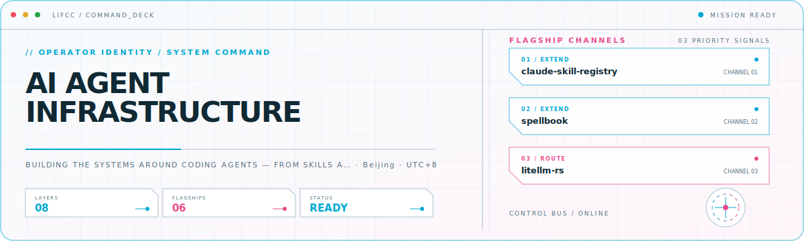
</picture>

<details>
<summary>View the execution deck</summary>

<picture>
  <source media="(prefers-color-scheme: dark)" srcset="examples/lifcc/command-deck-output/assets/closed-loop-dark.svg">
  <source media="(prefers-color-scheme: light)" srcset="examples/lifcc/command-deck-output/assets/closed-loop-light.svg">
  
</picture>

</details>

### Signal Grid (`signal-grid`)

<picture>
  <source media="(prefers-color-scheme: dark)" srcset="examples/lifcc/signal-grid-output/assets/hero-dark.svg">
  <source media="(prefers-color-scheme: light)" srcset="examples/lifcc/signal-grid-output/assets/hero-light.svg">
  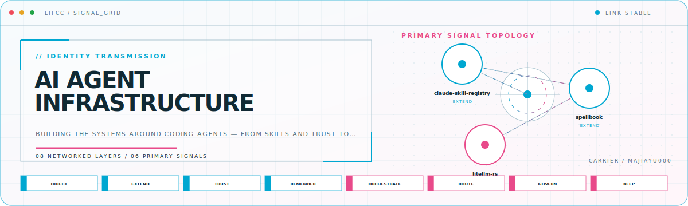
</picture>

<details>
<summary>View the signal topology</summary>

<picture>
  <source media="(prefers-color-scheme: dark)" srcset="examples/lifcc/signal-grid-output/assets/closed-loop-dark.svg">
  <source media="(prefers-color-scheme: light)" srcset="examples/lifcc/signal-grid-output/assets/closed-loop-light.svg">
  
</picture>

</details>

### Editorial

<picture>
  <source media="(prefers-color-scheme: dark)" srcset="examples/lifcc/editorial-output/assets/hero-dark.svg">
  <source media="(prefers-color-scheme: light)" srcset="examples/lifcc/editorial-output/assets/hero-light.svg">
  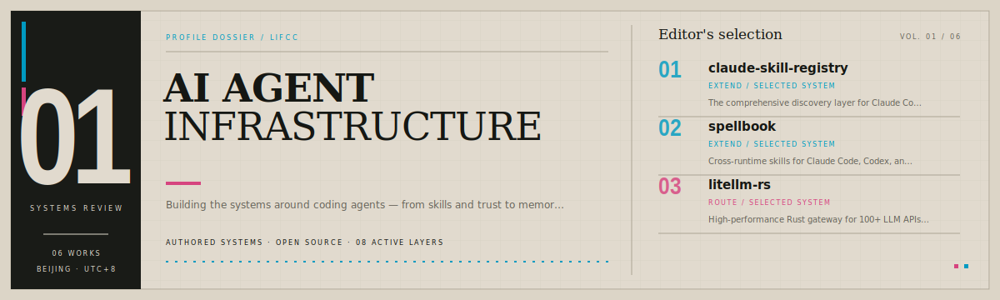
</picture>

<details>
<summary>View the working index</summary>

<picture>
  <source media="(prefers-color-scheme: dark)" srcset="examples/lifcc/editorial-output/assets/closed-loop-dark.svg">
  <source media="(prefers-color-scheme: light)" srcset="examples/lifcc/editorial-output/assets/closed-loop-light.svg">
  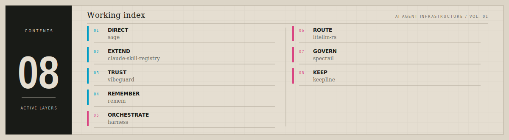
</picture>

</details>

### Developer Workbench (`bento-grid`)

<picture>
  <source media="(prefers-color-scheme: dark)" srcset="examples/lifcc/bento-grid-output/assets/hero-dark.svg">
  <source media="(prefers-color-scheme: light)" srcset="examples/lifcc/bento-grid-output/assets/hero-light.svg">
  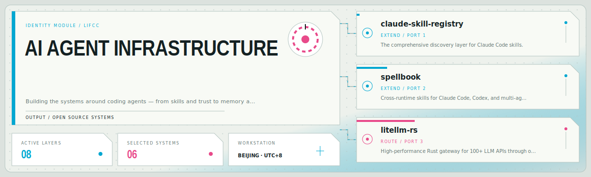
</picture>

<details>
<summary>View the connected build map</summary>

<picture>
  <source media="(prefers-color-scheme: dark)" srcset="examples/lifcc/bento-grid-output/assets/closed-loop-dark.svg">
  <source media="(prefers-color-scheme: light)" srcset="examples/lifcc/bento-grid-output/assets/closed-loop-light.svg">
  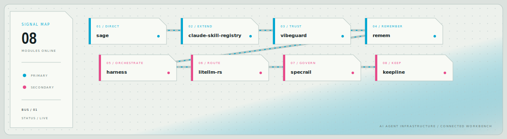
</picture>

</details>

### Terminal

<picture>
  <source media="(prefers-color-scheme: dark)" srcset="examples/lifcc/terminal-output/assets/hero-dark.svg">
  <source media="(prefers-color-scheme: light)" srcset="examples/lifcc/terminal-output/assets/hero-light.svg">
  
</picture>

<details>
<summary>View the process tree</summary>

<picture>
  <source media="(prefers-color-scheme: dark)" srcset="examples/lifcc/terminal-output/assets/closed-loop-dark.svg">
  <source media="(prefers-color-scheme: light)" srcset="examples/lifcc/terminal-output/assets/closed-loop-light.svg">
  
</picture>

</details>

### Blueprint

<picture>
  <source media="(prefers-color-scheme: dark)" srcset="examples/lifcc/blueprint-output/assets/hero-dark.svg">
  <source media="(prefers-color-scheme: light)" srcset="examples/lifcc/blueprint-output/assets/hero-light.svg">
  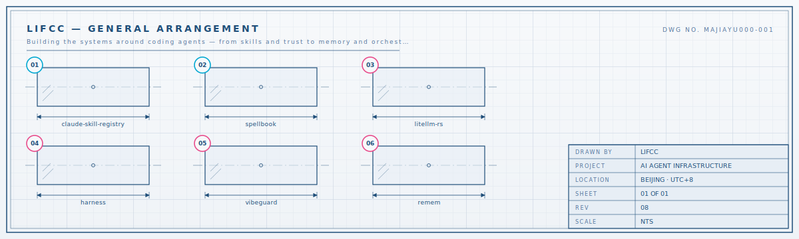
</picture>

<details>
<summary>View the assembly drawing</summary>

<picture>
  <source media="(prefers-color-scheme: dark)" srcset="examples/lifcc/blueprint-output/assets/closed-loop-dark.svg">
  <source media="(prefers-color-scheme: light)" srcset="examples/lifcc/blueprint-output/assets/closed-loop-light.svg">
  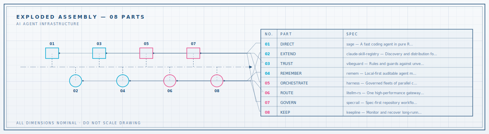
</picture>

</details>

### Constellation

<picture>
  <source media="(prefers-color-scheme: dark)" srcset="examples/lifcc/constellation-output/assets/hero-dark.svg">
  <source media="(prefers-color-scheme: light)" srcset="examples/lifcc/constellation-output/assets/hero-light.svg">
  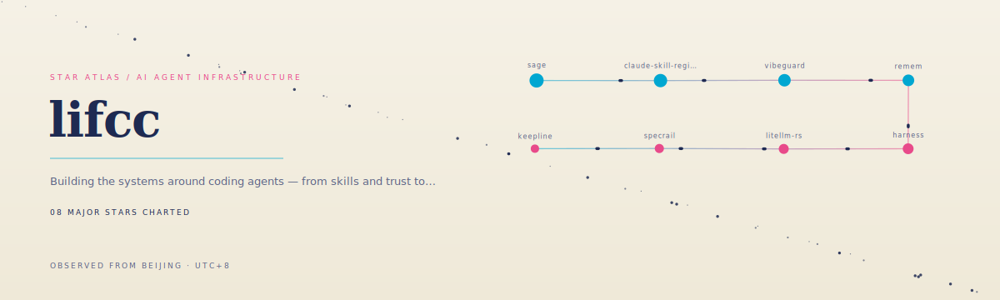
</picture>

<details>
<summary>View the star chart</summary>

<picture>
  <source media="(prefers-color-scheme: dark)" srcset="examples/lifcc/constellation-output/assets/closed-loop-dark.svg">
  <source media="(prefers-color-scheme: light)" srcset="examples/lifcc/constellation-output/assets/closed-loop-light.svg">
  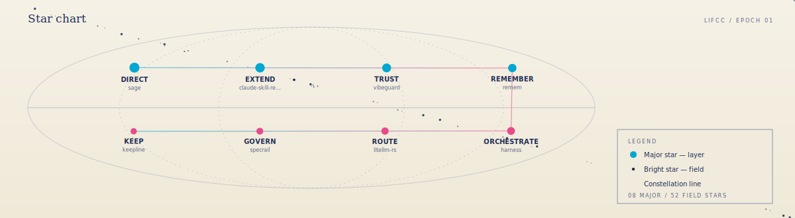
</picture>

</details>

### Metro Map (`metro`)

<picture>
  <source media="(prefers-color-scheme: dark)" srcset="examples/lifcc/metro-output/assets/hero-dark.svg">
  <source media="(prefers-color-scheme: light)" srcset="examples/lifcc/metro-output/assets/hero-light.svg">
  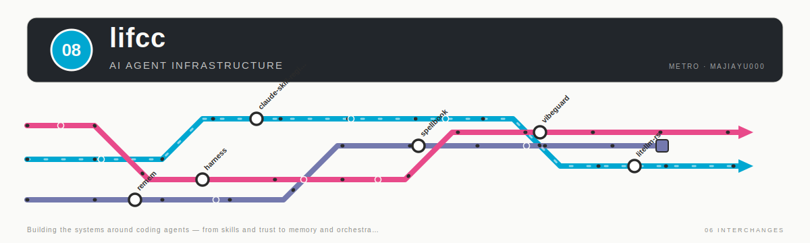
</picture>

<details>
<summary>View the network map</summary>

<picture>
  <source media="(prefers-color-scheme: dark)" srcset="examples/lifcc/metro-output/assets/closed-loop-dark.svg">
  <source media="(prefers-color-scheme: light)" srcset="examples/lifcc/metro-output/assets/closed-loop-light.svg">
  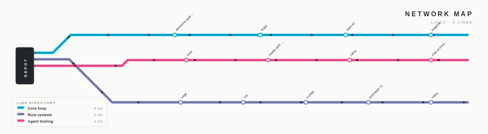
</picture>

</details>

## Quick start

The package is currently distributed from GitHub. Build and link the CLI locally:

```bash
git clone https://github.com/majiayu000/profile-control-plane.git
cd profile-control-plane
npm ci
npm link
```

Create a starter configuration from public GitHub metadata:

```bash
profilectl init YOUR_GITHUB_USERNAME
profilectl check
profilectl preview --all-templates
```

Open the printed comparison page, choose a direction, set `theme.preset`, and refine `profile.yaml` until it
tells the right story. Then build:

```bash
profilectl build --out .profile-output
```

If the unauthenticated GitHub API is rate-limited, provide an existing token only for `init`:

```bash
GITHUB_TOKEN=your_token profilectl init YOUR_GITHUB_USERNAME
```

The token is read from the environment and is never written to the configuration or generated assets.

## Configuration

```yaml
version: 1
github:
  username: octocat
identity:
  name: Octocat
  headline: AGENT INFRASTRUCTURE
  tagline: Building the systems around coding agents.
theme:
  preset: control-plane
  primary: "#00A7D1"
  secondary: "#E84A8A"
layers:
  - name: DIRECT
    project: agent-cli
    description: The primary execution surface
    tone: primary
flagships:
  - repo: agent-cli
    role: EXECUTE
    description: A fast, inspectable coding agent.
    tone: primary
module_groups: []
settings:
  show_stars: true
  show_badges: true
```

The complete contract is [`schemas/profile.schema.json`](schemas/profile.schema.json). The starter importer
uses factual GitHub names, descriptions, languages, stars, and timestamps. It deliberately emits generic
`SYSTEM 01` / `PROJECT 01` labels because semantic architecture should be reviewed, not hallucinated.

See the curated [lifcc configuration](examples/lifcc/profile.yaml) and its [generated output](examples/lifcc/output/README.md).

### Templates

| Preset          | Best fit                                          | Visual language                         |
| --------------- | ------------------------------------------------- | --------------------------------------- |
| `control-plane` | Infrastructure, agent systems, connected tooling  | Animated control room and systems loop  |
| `command-deck`  | Operations-heavy systems and flagship execution   | Mission console and command bus         |
| `signal-grid`   | Networked projects and relationship-heavy systems | Signal topology and connected mesh      |
| `editorial`     | Maintainers, researchers, selected body of work   | Technical journal and working index     |
| `bento-grid`    | Product builders and modular project portfolios   | Connected workbench and signal map      |
| `terminal`      | CLI tools, daemons, and hands-on builders         | Live shell session and process tree     |
| `blueprint`     | Spec-driven engineering and deliberate systems    | Engineering drawing and assembly map    |
| `constellation` | Broad portfolios with a few standout projects     | Animated star atlas and signal chain    |
| `metro`         | Many repositories grouped into clear domains      | Transit network with moving train paths |

The bundled agent skill can recommend a preset from repository evidence. The user remains the decision
maker: `profilectl preview --all-templates` renders the same configuration in all nine directions before
anything is built or staged.

## Commands

| Command                              | Purpose                                                                |
| ------------------------------------ | ---------------------------------------------------------------------- |
| `profilectl init <username>`         | Import public metadata into a reviewable starter config.               |
| `profilectl build`                   | Compile README and SVGs into a dedicated output directory.             |
| `profilectl preview`                 | Serve the selected template in dark/light mode at `127.0.0.1`.         |
| `profilectl preview --all-templates` | Compare every template using the same configuration.                   |
| `profilectl check`                   | Validate schema, generated XML, references, and optional online links. |

Use `--help` on any command for options. `build --force` refuses to replace the current directory, a
filesystem root, or any directory containing `.git`.

## Publish safely

Generated output is intentionally separate from your profile repository. On a new branch in the
`USERNAME/USERNAME` repository, copy only these files:

```text
.profile-output/README.md  -> README.md
.profile-output/assets/    -> assets/
```

Review the rendered branch and diff before merging. The CLI never commits, pushes, changes pins, or merges
to `main`.

## Agent skill

Copy the bundled skill into your agent skill directory, or reference it from this repository:

```bash
cp -R skills/design-github-profile ~/.codex/skills/
```

Then ask: `Use $design-github-profile to redesign my GitHub profile.` The skill audits existing profile
files, separates verified facts from interpretations and user intent, proposes an evidence-backed profile
direction, and evaluates the rendered result before preparing a preview branch. Detailed archetypes, visual
guidelines, and the publication rubric load only when the task needs them.

The agent recommends a narrative and a supported preset, explains its evidence, and can render all templates
for user choice. If the desired visual direction is outside the declared presets, it reports the capability
gap instead of inventing a `theme.preset` or forcing the account into an unsupported metaphor.

## Design and safety

The compiler is pure: validated config goes in; static strings come out. Network and filesystem behavior
live in explicit adapters. SVG output is XML-validated and rejected if it contains script elements, event
attributes, or JavaScript URLs. Files are staged before an atomic directory replacement.

Read the [architecture foundation](docs/architecture.md), [security policy](SECURITY.md), and
[contribution guide](CONTRIBUTING.md) for details.

## Development

```bash
npm ci
npm run check
npm pack --dry-run
```

The test gate requires at least 80% line, statement, function, and branch coverage.

## License

[MIT](LICENSE) © lifcc
