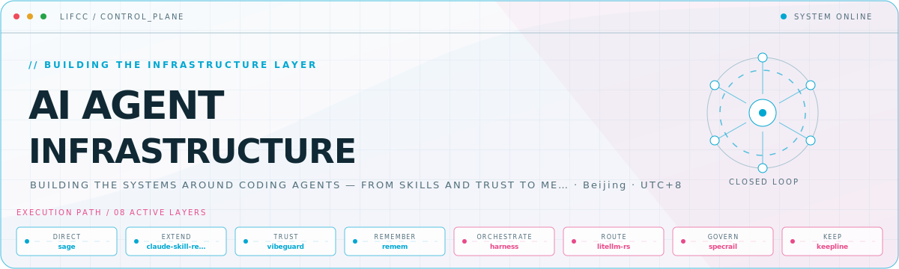
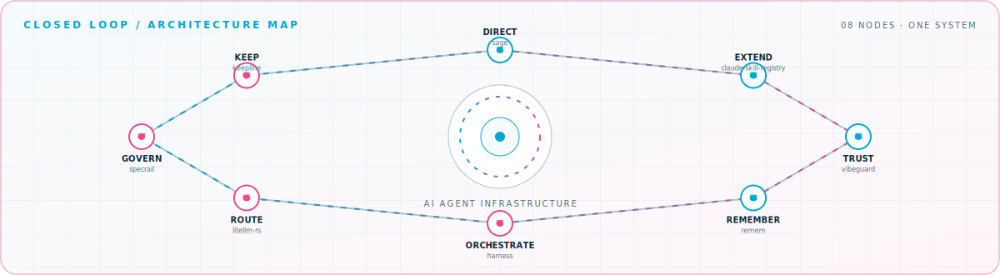

<picture>
  <source media="(prefers-color-scheme: dark)" srcset="assets/hero-dark.svg">
  <source media="(prefers-color-scheme: light)" srcset="assets/hero-light.svg">
  
</picture>

 

Building the systems around coding agents — from skills and trust to memory and orchestration\.

## Flagship systems

| Repository | Role | Purpose |
| --- | --- | --- |
| [`claude-skill-registry`](https://github.com/majiayu000/claude-skill-registry)  | EXTEND | The comprehensive discovery layer for Claude Code skills\. |
| [`spellbook`](https://github.com/majiayu000/spellbook)  | EXTEND | Cross-runtime skills for Claude Code, Codex, and multi-agent workflows\. |
| [`litellm-rs`](https://github.com/majiayu000/litellm-rs)  | ROUTE | High-performance Rust gateway for 100\+ LLM APIs through one format\. |
| [`harness`](https://github.com/majiayu000/harness)  | ORCHESTRATE | Governed fleets of parallel coding agents, powered by a Rust control plane\. |
| [`vibeguard`](https://github.com/majiayu000/vibeguard)  | TRUST | Rules, hooks, and guards against hallucinated or unverified agent changes\. |
| [`remem`](https://github.com/majiayu000/remem)  | REMEMBER | Local-first, auditable memory for long-running Claude Code and Codex work\. |

## Closed-loop architecture

<picture>
  <source media="(prefers-color-scheme: dark)" srcset="assets/closed-loop-dark.svg">
  <source media="(prefers-color-scheme: light)" srcset="assets/closed-loop-light.svg">
  
</picture>

## Module registry

<strong>Core loop</strong> · 4 modules

| Module | Purpose |
| --- | --- |
| [`awesome-goal-prompts`](https://github.com/majiayu000/awesome-goal-prompts) | 114 source-backed goal contracts for coding agents\. |
| [`argus`](https://github.com/majiayu000/argus) | Install-time supply-chain scanner for package ecosystems\. |
| [`specrail`](https://github.com/majiayu000/specrail) | Spec-first rails for agent-assisted repository workflows\. |
| [`keepline`](https://github.com/majiayu000/keepline) | Session command center for monitoring and recovery\. |

<strong>Rust systems</strong> · 5 modules

| Module | Purpose |
| --- | --- |
| [`sage`](https://github.com/majiayu000/sage) | Blazing-fast coding agent in pure Rust\. |
| [`rnk`](https://github.com/majiayu000/rnk) | Declarative TUI framework with React-like hooks\. |
| [`ccstats`](https://github.com/majiayu000/ccstats) | Claude Code and Codex usage analytics CLI\. |
| [`jsonrepair-rs`](https://github.com/majiayu000/jsonrepair-rs) | Repair malformed JSON from LLM output\. |
| [`rekey`](https://github.com/majiayu000/rekey) | Agent credential-isolation proxy\. |

<strong>Agent tooling</strong> · 4 modules

| Module | Purpose |
| --- | --- |
| [`loom`](https://github.com/majiayu000/loom) | Skill registry and projection control plane\. |
| [`claude-skill-manager`](https://github.com/majiayu000/claude-skill-manager) | Discover, install, and manage Claude Code skills\. |
| [`refine`](https://github.com/majiayu000/refine) | Extract reusable knowledge from agent conversations\. |
| [`chat-archive-rs`](https://github.com/majiayu000/chat-archive-rs) | Archive and search Claude Code and Codex sessions\. |

<a href="https://github.com/majiayu000">GitHub</a> · <a href="https://silencestar.com">Blog</a> · <a href="mailto:mylifcc@gmail.com">Email</a>

<!-- Generated by profile-control-plane. Edit profile.yaml, not this file. -->
